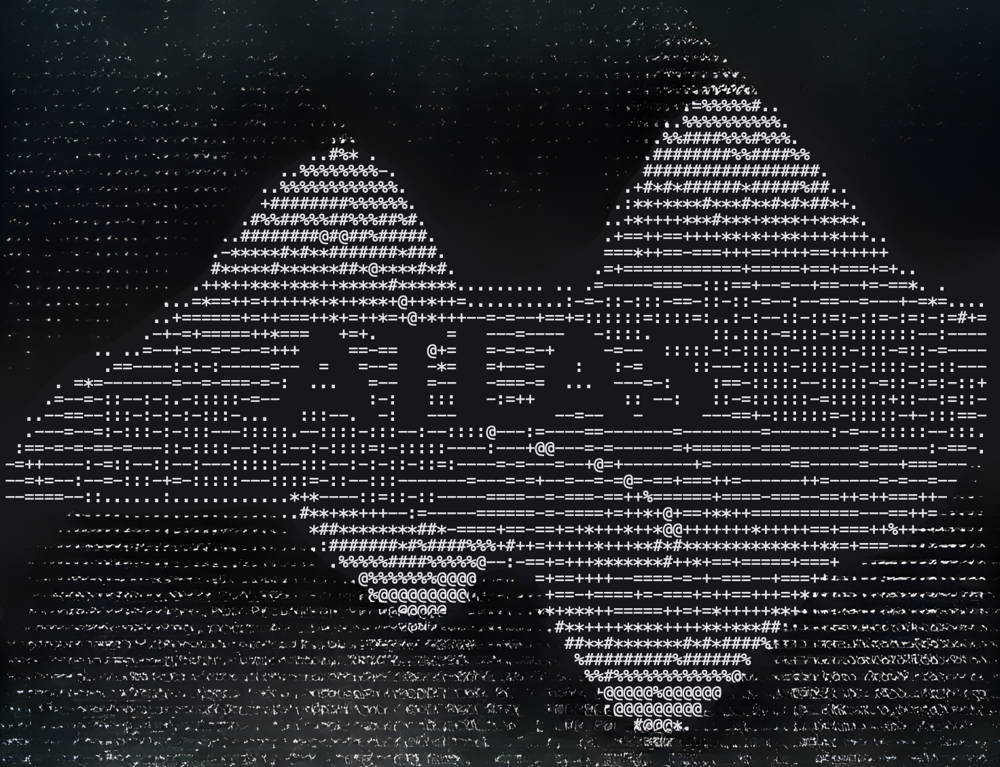

# A.T.L.A.S.

**Adaptive Test-time Learning and Autonomous Specialization**

ATLAS achieves **74.6% LiveCodeBench pass@1** with a frozen 14B model on a single consumer GPU — up from 37% in V2 — through constraint-driven generation and self-verified iterative refinement. No fine-tuning, no API calls, no cloud. Just a $500 GPU and smart inference.

**V3.0.1** ships ATLAS as an **interactive coding assistant** you can download and use today. Type `atlas` in any project directory and start building.


---

## Why ATLAS Exists

I'm a business student at Virginia Tech. My background is in marketing, not computer science. I'm a hobbyist who got curious about what's possible when you stop assuming only the biggest players can build meaningful things.

My twin sister was born with Loeys-Dietz syndrome. When we were five, doctors told my parents she would never walk. A year later, she walked into that same doctor's office. She remembered looking back at him and seeing tears in his eyes. She passed away last year on March 29th. But that memory stayed with me. The people who tell you what's impossible are usually just describing the limits of their own experience. Sometimes all it takes is a single moment to realize the barrier was never technical — it was assumption.

ATLAS isn't the destination. It's proof of what we can build.

---

## Download and Use It

```bash
# Clone
git clone https://github.com/itigges22/ATLAS.git && cd ATLAS

# Download model weights (~7GB)
mkdir -p models && cd models
# Download Qwen3.5-9B-Q6_K.gguf from HuggingFace
cd ..

# Configure and start
cp .env.example .env        # Edit: set ATLAS_MODELS_DIR
podman-compose up -d         # or: docker compose up -d

# Start coding
atlas
```

That's it. Five commands. ATLAS starts all services, connects to the model, and drops you into an interactive coding session. Ask it to build anything.

See [docs/SETUP.md](docs/SETUP.md) for detailed setup (Docker, bare-metal, K3s).

---

## Benchmark Results

> **Important**: The 74.6% benchmark was run on **Qwen3-14B** (V3.0). The CLI currently runs **Qwen3.5-9B** (V3.0.1). Formal benchmarks on the 9B model under the CLI pipeline have not yet been run — that is V3.1 work. The V3 pipeline architecture is identical; only the base model differs.

> Hardware: RTX 5060 Ti 16GB | Model: Qwen3-14B-Q4_K_M (frozen, V3.0)

| Benchmark | Score | Tasks | Method |
|-----------|-------|-------|--------|
| **LiveCodeBench v5** | **74.6% pass@1*** | 599 | V3 pipeline: PlanSearch + self-verified PR-CoT repair |
| **GPQA Diamond** | **47.0%** | 198 | k=5, multiple-choice knowledge reasoning |
| **SciCode** | **14.7%** (sub-problems) | 341 | k=1, cross-domain scientific coding |

\*pass@1 = one solution submitted per task, but generated via best-of-3 candidates + Lens selection + iterative repair on failures. Not single-shot generation. See [methodology](docs/V3_ABLATION_STUDY.md#2-methodology).

<details>
<summary><b>V3 ablation breakdown (Qwen3-14B)</b></summary>

| Condition | Configuration | Pass Rate | Delta |
|-----------|---------------|-----------|-------|
| A | Baseline (no V3) | 54.9% | — |
| B | +Phase 1 (PlanSearch + BudgetForcing + DivSampling) | 67.3% | +12.4pp |
| C | +Phase 1+2 (Lens routing) | 67.3% | +0.0pp |
| D | +Phase 1+3 (self-verified refinement) | **74.6%** | +7.3pp |

Phase 3 uses self-generated test cases for internal verification — the model never sees the answer key during repair. PR-CoT rescues 36/42 tasks (85.7% of Phase 3 rescues). Full report: [V3_ABLATION_STUDY.md](docs/V3_ABLATION_STUDY.md)

Raw ablation data: [`v3_ablation_results/`](v3_ablation_results/) — per-task pass/fail for all conditions.

</details>

### CLI Reliability (Qwen3.5-9B, V3.0.1)

The interactive CLI has been validated across 8 difficulty levels × 3 iterations:

| Test | Description | Pass Rate |
|------|-------------|-----------|
| L1 | Conversational response | 100% |
| L2 | Create snake game (curses) | 100% |
| L3 | Fix broken collision detection | 100% |
| L4 | Add persistent high scores | 100% |
| L5 | Create multi-file Next.js project | 100% |
| L6 | Add JWT auth to existing project | 67% |
| L7 | Delete files from project | 100% |
| L8 | Lint and fix TypeScript errors | 100% |
| | **Overall** | **95.8%** |

5-language integration: Python, Rust, Go, C, Shell — **all pass** (compile + run).

Full training data and benchmark traces: [ATLAS Dataset on HuggingFace](https://huggingface.co/datasets/itigges22/ATLAS)

---

## How It Works

ATLAS uses a two-layer architecture:

```
┌─────────────────────────────────────────────────────┐
│  User types `atlas` in any project directory          │
│                                                      │
│  Aider (TUI) ──► atlas-proxy (agent loop)            │
│                    │                                  │
│    OUTER LAYER:    │  Structured JSON tool calls      │
│    Agent Loop      │  Grammar-constrained output      │
│                    │  8 tools: read, write, edit,     │
│                    │  delete, run, search, list, plan │
│                    │                                  │
│    INNER LAYER:    │  V3 Pipeline (T2/T3 files)       │
│    V3 Pipeline     │  PlanSearch → DivSampling →      │
│                    │  Budget Forcing → Build Verify →  │
│                    │  C(x)/G(x) Score → Best-of-K →   │
│                    │  PR-CoT Repair → Select Winner   │
│                    │                                  │
│    ┌───────────────┼──────────────────────┐          │
│    │ llama-server  │  geometric-lens      │ sandbox  │
│    │ (CUDA, 32K)   │  C(x)/G(x) scoring   │ (code   │
│    │ ~51 tok/s     │  Val AUC 0.9467      │  exec)  │
│    └───────────────┴──────────────────────┘          │
└─────────────────────────────────────────────────────┘
```

**The model writes code. The infrastructure makes it reliable.**

- **Outer layer** (agent loop): Grammar enforcement guarantees 100% valid JSON tool calls. The model reads files, writes code, runs commands, and verifies its own work — iterating until done.
- **Inner layer** (V3 pipeline): Feature files (50+ lines with logic) get diverse candidate generation, build verification, energy-based scoring, and automated repair. Config files skip the pipeline entirely.
- **Geometric Lens**: Neural scoring that evaluates code correctness from embeddings alone — C(x) cost field achieves 0.9467 AUC without executing the code.

Full architecture: [docs/ARCHITECTURE.md](docs/ARCHITECTURE.md)

---

## Hardware Requirements

| Resource | Minimum | Tested |
|----------|---------|--------|
| GPU VRAM | 16 GB | RTX 5060 Ti 16 GB |
| System RAM | 14 GB | 16 GB |
| Disk | 20 GB free | For model weights + containers |
| Python | 3.10+ | 3.11 |
| OS | Linux (RHEL, Ubuntu, Arch) | RHEL 9 |

---

## Project Structure

```
ATLAS/
├── atlas-proxy/          Go proxy — agent loop, grammar, 8 tools
├── geometric-lens/       C(x)/G(x) scoring service (Geometric Lens)
├── benchmark/            Benchmark runner + V3 pipeline (20 modules)
├── v3-service/           V3 pipeline HTTP service
├── inference/            llama-server Dockerfiles
├── sandbox/              Isolated code execution
├── scripts/              Build, deploy, train, validate
├── tests/                33 test files (infrastructure + V3)
├── v3_ablation_results/  Published ablation data (A–D, 599 tasks each)
├── docs/                 Full documentation suite
├── docker-compose.yml    One-command deployment
└── atlas.conf.example    Configuration template
```

---

## Documentation

| Document | Description |
|----------|-------------|
| **[SETUP.md](docs/SETUP.md)** | Installation — Docker, bare-metal, K3s |
| **[ARCHITECTURE.md](docs/ARCHITECTURE.md)** | Two-layer architecture, component design |
| **[CLI.md](docs/CLI.md)** | CLI usage, streaming output, tips |
| **[MAP.md](docs/MAP.md)** | Visual guide to every file in the repo |
| **[API.md](docs/API.md)** | HTTP API endpoints and formats |
| **[CONFIGURATION.md](docs/CONFIGURATION.md)** | All environment variables and config |
| **[TROUBLESHOOTING.md](docs/TROUBLESHOOTING.md)** | Common issues and solutions |
| **[V3_ABLATION_STUDY.md](docs/V3_ABLATION_STUDY.md)** | Ablation methodology and results |
| **[CHANGELOG.md](CHANGELOG.md)** | Release history |

<details>
<summary><b>Historical documentation</b></summary>

| Document | Description |
|----------|-------------|
| **[V2_5_ABLATION_STUDY.md](docs/V2_5_ABLATION_STUDY.md)** | V2.5 Geometric Lens ablation |
| **[V2_TO_V2_5_MIGRATION.md](docs/V2_TO_V2_5_MIGRATION.md)** | V2 to V2.5 migration |

</details>

---

## Roadmap

**V3.0** — Complete (2026-03-05). 74.6% LCB pass@1 on frozen Qwen3-14B. [Full ablation report](docs/V3_ABLATION_STUDY.md).

**V3.0.1** — Complete (2026-04-05). Interactive CLI with tool-call agent loop, Docker Compose deployment, V3 pipeline integration, 95.8% reliability. **This is the current release.**

**V3.1** — In Progress.
- **Benchmarks** (not yet run): LiveCodeBench v5 on Qwen3.5-9B with CLI pipeline, GPQA Diamond, SciCode, AA-LCR, AA-Omniscience, Humanity's Last Exam, CritPt
- **Fox optimization**: C-side sampler chain for grammar speed (14→50 tok/s target)
- **Geometric Lens**: Online C(x) recalibration, G(x) redesign
- **Target**: 80-90% LCB pass@1

---

## License

Licensed under the [A.T.L.A.S Source Available License v1.0](LICENSE).

## Contributing

See [CONTRIBUTING.md](CONTRIBUTING.md).
